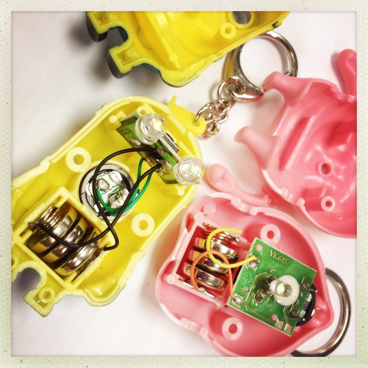
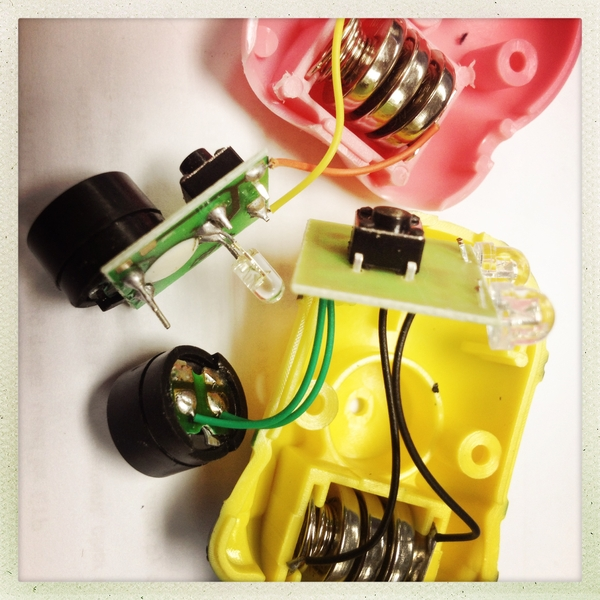
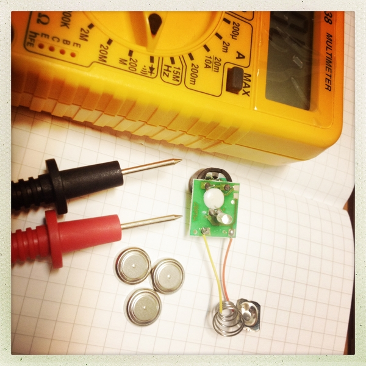
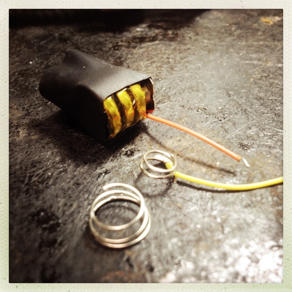
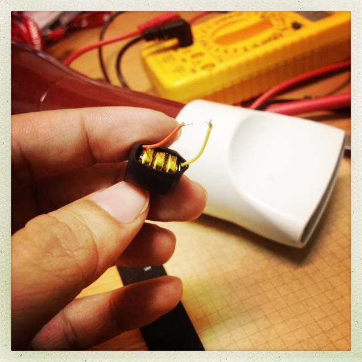
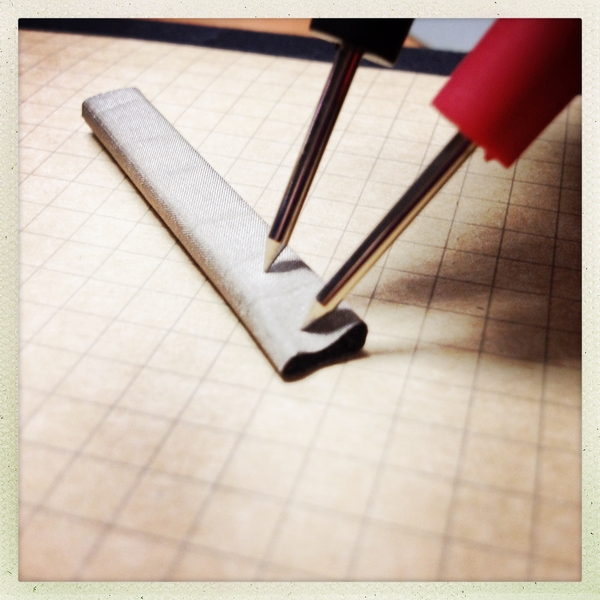
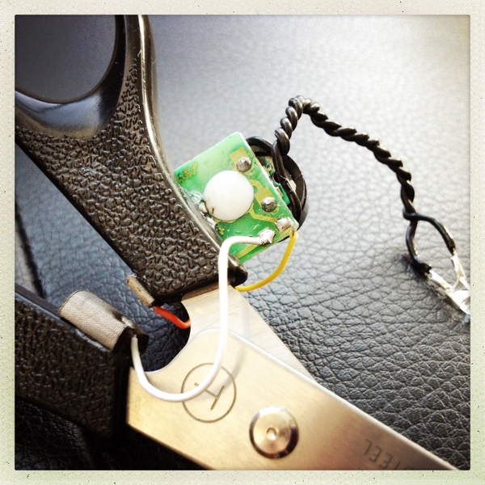
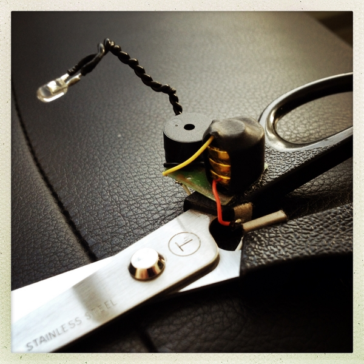
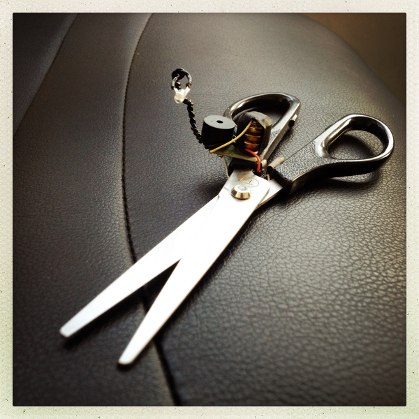
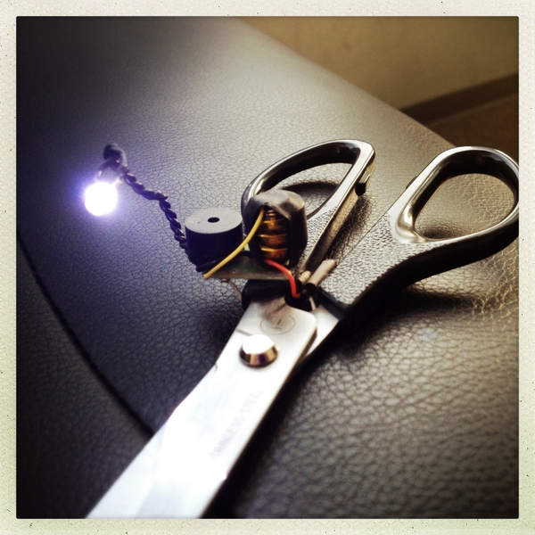

哇哈哈剪刀
====================

The Idea
--------
當你用剪刀剪東西的時候，超過一個角度就會發出訕笑聲。

[點圖片看demo]

Hacking
-------
在這個專案中，我嘗試將玩具鑰匙圈的電路板，與剪刀做結合。你可以找尋任何可以發出聲音的鑰匙圈或是布偶。這是我在露天拍賣花 $49/個 買的鑰匙圈。

[點圖片看影片]

拆開後發現它的電路結構其實不複雜，就是以一顆按鈕，控制要不要讓鈕扣電池的電力，通過電路板上的元件。

當然，你需要用電表來確認，哪個接點跟哪條線是相連的。這樣最後組裝時才不會搞錯正負極。

我跟公司的硬體工程師要了一小段熱縮管，先用膠帶簡單把三顆鈕扣電池固定，然後塞進熱縮管裡。接著將原本正負兩極用的鐵片也塞進去，把導線拉出來。

正極用的那圈彈簧不需要這麼長，為了方便塞進去熱縮套管中，我只剪了一小段用。

因為熱縮管受熱就會漸漸地縮小，所以只要用吹風機小心地吹過。(硬體工程師跟我說水銀電池怕熱，要小心!)。就可以像這樣將電池和正負導線固定得很好囉。

然後將電路板上的按鈕解焊，因為我不需要那個按鈕。之後原本「按下按鈕」的動作，會變成是以「剪刀剪下去」的動作來觸發。

我一直在思考怎麼在剪刀上面做個像「開關」那樣的電路。最後覺得比較好的方式就是用握柄的部分，當剪刀剪下去的時候，握柄的角度會縮小，完整剪下後，剪刀的兩個握柄其實是相連的，這個相連點就可以將正負導線拉過來，形成一個有開關概念的電路。

但是我又不希望得要「完全剪下」的動作發生時才有反應，回想自己用剪刀的習慣，其實很少是有完整剪下的動作的。所以應該是大於某個角度的時候，就必須讓電路形成迴路，發出聲響。

我第一個想到的就是用海綿當緩衝，然後把導線固定在上面，公司的廢料區有很多包裝設備用的海綿或是保麗龍塊，應該可以派上用場。後來我又在廢料區發現了一個有趣的東西。

我不知道它正確的名稱，它像是有一圈布面的東西包住一塊海綿。因為我是在電路板上發現的，加上他摸起來的觸感，所以我直覺就覺得這塊東西是導電的。

馬上用電表量看看，果然是可以導通的。這對簡化我的工作非常有幫助，於是我剪了兩小塊，將正負導線直接焊上那片導電體，然後用強力膠固定在握柄上。因為固定的位子比較前面，所以只要剪刀剪下超過一個角度後，兩塊導電的海綿就會接觸形成迴路，就可以驅使電路發出聲音囉。

然後我也將原本的 LED 用導線接長，製造出像燈籠魚般的造型。但沒有任何實質功用就是了，只是增加聲光效果 XD

這就是最終的樣子囉，剪刀剪下的時候，會發出很機車的笑聲，然後 LED 燈也會閃爍。

~ END ~