Draailampje 翻轉燈
====================

The Idea
--------
我在 [Makezine](http://www.makezine.com.tw/) 看到 David Bakker 寫的這篇 [自製翻轉燈](http://www.makezine.com.tw/make2599131456/162)。

"draailampje"，是荷蘭文「翻轉燈」的意思。就是你上下轉個 180 度，LED 燈就會亮。

覺得這東西蠻可愛的，技術難度也很低，很適合跟家中的小朋友一起做。所以打算自己做一個來玩看看。

其實在 [David Bakker 的官網](http://www.davidbakker.nl/) 中已經有詳細的製作流程說明了。

* [pdf 教學文件](http://www.davidbakker.nl/wp-content/uploads/2015/11/draailampje-vouwen-en-buigen-instructie-v1.0.pdf)
* [youtube 影片教學](https://www.youtube.com/watch?v=3-AEKdpEs3A)

我在實作時因為有一些考量，也因為遇到一些問題，所以做了些微的調整。這是我最後做出來的樣子。[點圖片看demo]

Hacking
-------
當然，你要先有一個玻璃容器，這是我在 ニトリ(宜得利家居) 花 $39 TWD 買的玻璃瓶。大約是 50ml 的大小。(後來我覺得應該要再更小比較好，後面會說明) 

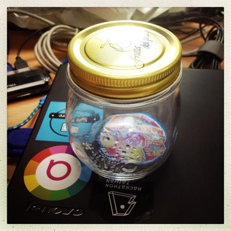

然後這是我準備的材料，大多是仿照 David Bakker 教學裡面所準備的材料。

* 10mm LED (看你喜歡甚麼顏色)
* tilt switch (滾珠式傾斜開關)
* CR2032 鈕扣電池 (3V)
* CR2032 電池座
* (非必要) 4 pin 針腳母座

其中 CR2032 電池座，可能跟常見的不同。我在電子材料行挑了一個我認為比較好抽換電池的設計。但其實用哪一種都沒差。然後蓋子外面還有一個是四 pin 的針腳母座，因為我不打算把 LED 焊死。想要有個母座可以讓我隨時插換不同顏色的 LED 燈，然後看看他們的效果。

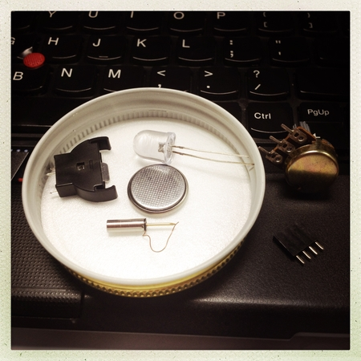

這個就是傾斜開關，又稱滾珠開關。先用電表測試看看是否真的可以正常運作。

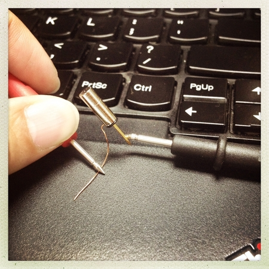

原理就像下圖所示，裡面有一顆或多顆滾珠，當傾斜角大於某個角度時，滾珠會落下，使得導線的兩端透過金屬滾珠接通。

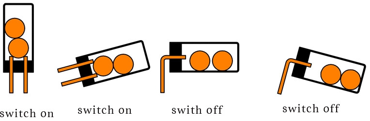

我買的 CR2032 電池座有接出三根線，也得用電表量看看，正負極分別是哪根。

針腳母座是我想用來抽換 LED 用的，由於 LED 只有兩根腳，所以我只需要兩個孔的母座，用鉗子暴力夾斷。

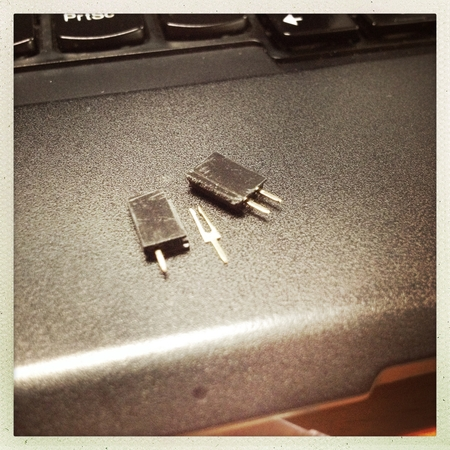

雖然這個電路蠻簡單的，但是為了保險起見，還是先在麵包板上做測試。當滾珠開關接通導線時，LED 就亮。

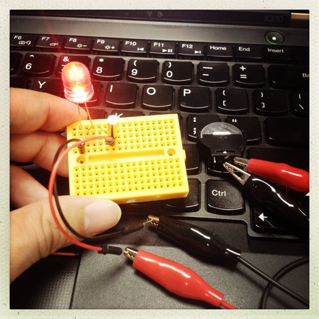

翻轉麵包板，讓滾珠不跟導線接觸，形成斷路。LED 就不會亮。

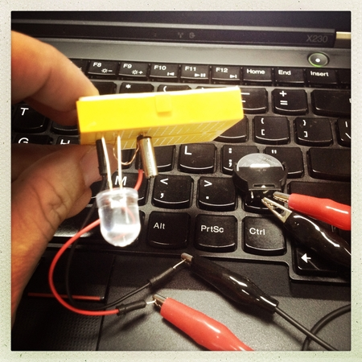

小改版
-----
然後...重點! 我在測試的時候發現，有時候即使已經呈現 90 度角了，LED 燈還是不亮。或是雖然有亮，但是會一直隨機閃爍。或是有時候發現要 45 度角才會一直亮。

後來我想了想，應該是因為滾珠開關畢竟是金屬的固體，他跟兩根導線的接觸點應該很小。而且就跟按鍵開關一樣，應該很容易產生彈跳現象 (contact bounce)。

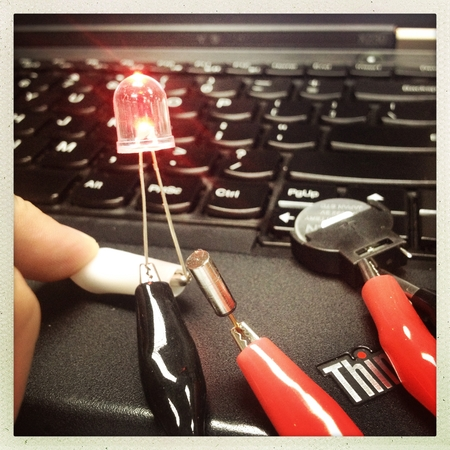

後來我想到以前曾經買過一個東西叫做「水銀開關」，它長這個樣子。裡面有一坨水銀，他跟滾珠式的傾斜開關一樣，同樣都是傾斜角大於一個數值的時候，水銀會接觸導線，讓導線兩端導通。

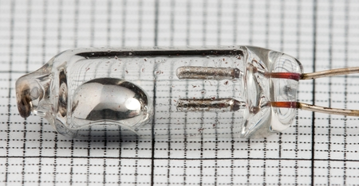

之前買這兩樣東西的時候，我一直想不透：同樣是傾斜開關，到底什麼時候該用哪一種？

現在覺得滾珠式的傾斜開關似乎比較適合一次性觸發的狀況，例如：你要做個電子骰子，那個 "骰" 的動作就很適合用滾珠開關來觸發。當然用水銀開關也可以，只是滾珠開關比較便宜，而且 "骰" 起來有聲音比較有 fu XD，也沒有怕熱的問題 (水銀怕熱)。

但如果像是我現在想做的專案，需要長時間接觸導通，且容許些微的搖晃。水銀畢竟是液體，對導線的接觸面積大，在些微地搖晃下也可以維持穩定地導通狀態。

把滾珠式的傾斜開關替換成水銀開關後，的確穩定很多，在容許的角度範圍內都可以保持 LED 恆亮，亮度也很穩定。

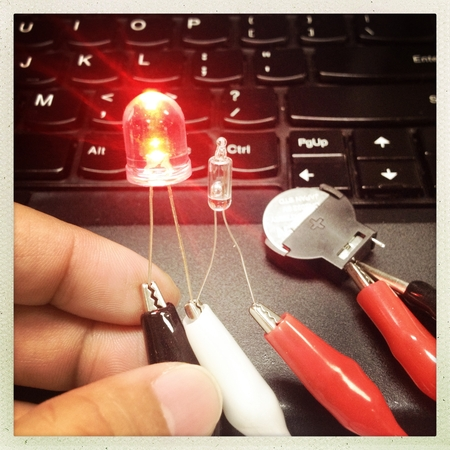

接下來就是勞作時間了。先把剪好的 2 pin 針腳母座，用強力膠水稍微黏在 CR2032 電池座附近。這個動作不做也可以，我只是為了等等方便焊接。

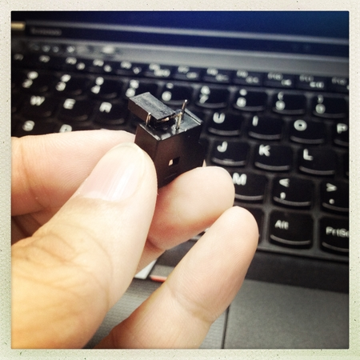

然後這是最終的材料，只是將傾斜開關從滾珠式換成水銀式的而已。

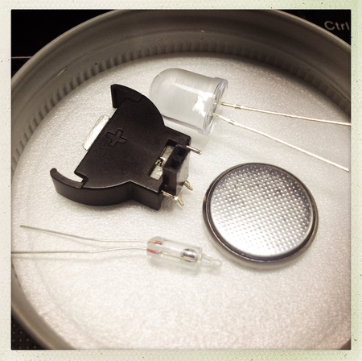

然後，如下圖。先把針腳母座的其中一端焊接到 CR2032 電池座的負端。再讓針腳母座的另一端，以焊接的方式透過水銀開關連接到　CR2032 電池座的正端。

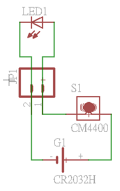

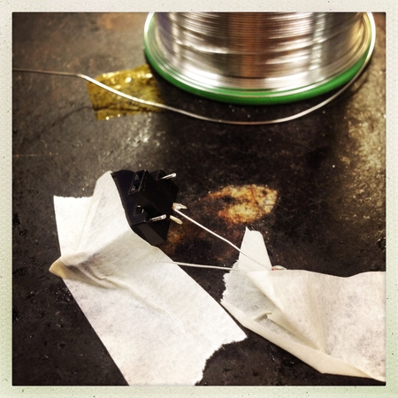

焊接好之後，只要把 CR2032 插上去，把 LED 插上腳座，就可以測試看看了。

另一個需要注意的是，你必須決定，翻轉的時候，到底是蓋子在上方時要亮？還是蓋子在下方時要亮？這跟調整水銀開關的角度有關。

原作者是蓋子在上方時亮，但我喜歡蓋子在下方的時候亮。所以我刻意將水銀開關的導線留很長，將來若是要更改方向的話，我只需要將水銀開關折 180 度即可。

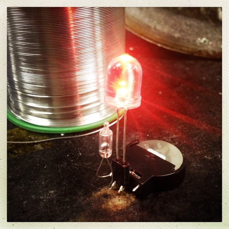

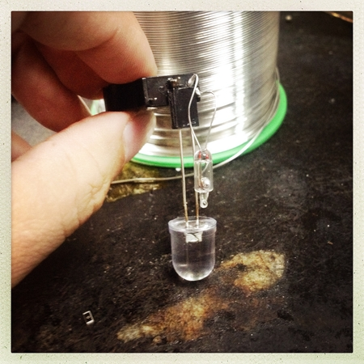

關於固定這組電路的方式，原作者是用簡單的雙面膠。但我腦中對於這個電路有些其他的想法，也許將來會想更改它，所以希望做成容易拆卸的方式。後來我發現那個上蓋是可以被我辦公桌上的磁鐵吸附的。所以我簡單用膠帶貼住磁鐵，固定在電路底下。如此我只要將電路 "吸" 在上蓋即可。

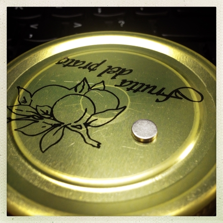

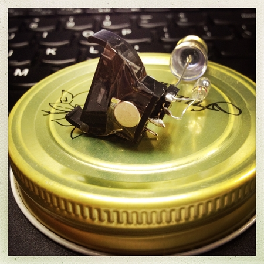

使用磁鐵的好處，就是你可以隨意調整 LED 的位置，例如儘可能地讓它置中。要換電池的時候也很容易拆裝。

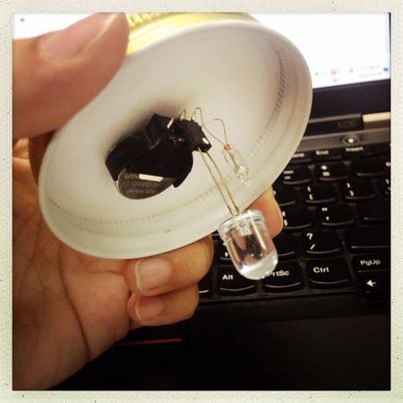

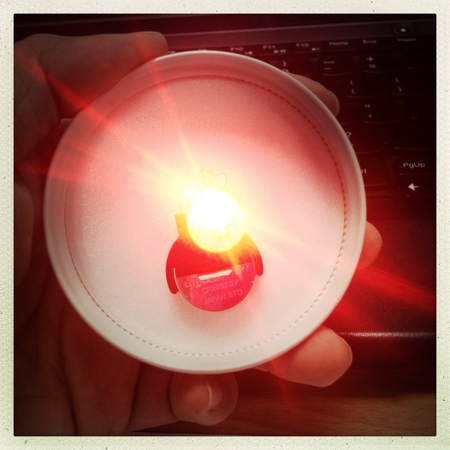

最後把它拴回去玻璃瓶中，就可以開始測試啦！

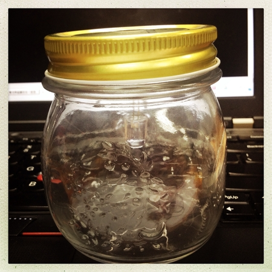

我覺得橘黃色蠻好看的，有種很溫暖的感覺。

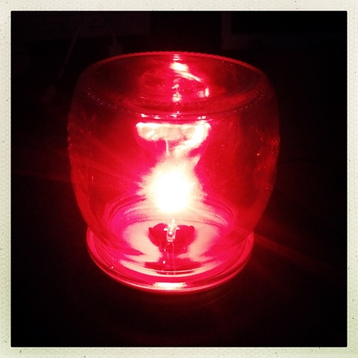

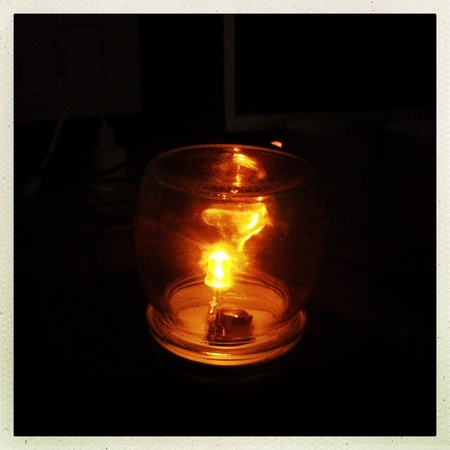

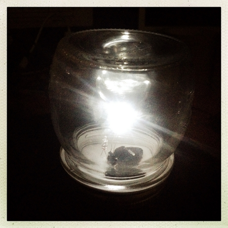

後來我覺得，透過瓶子散出來的光線有點弱，3V 電池透過 LED 發出來的光線亮度也沒有想像中的亮。

另一點是，我覺得或許 50ml 的玻璃瓶還是太大了。看了一下 David Bakker 的影片，那似乎只是一個小巧的果醬罐。我買的玻璃罐的玻璃好像也比較厚，或許用薄一點的會比較好。

如果把玻璃罐換成雞精罐那樣大小的應該效果會好一點。剛好我手邊有一個小玻璃罐，測試一下發現果然效果會好一點。然後不同顏色的 LED 燈，亮度似乎也不同。

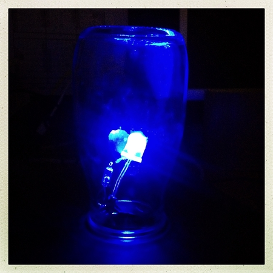

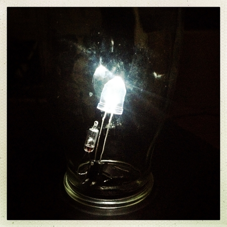

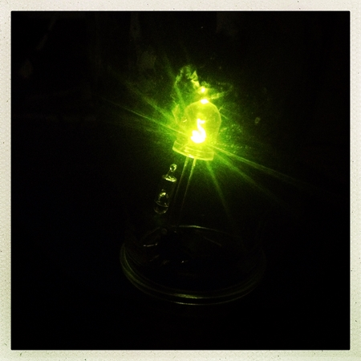

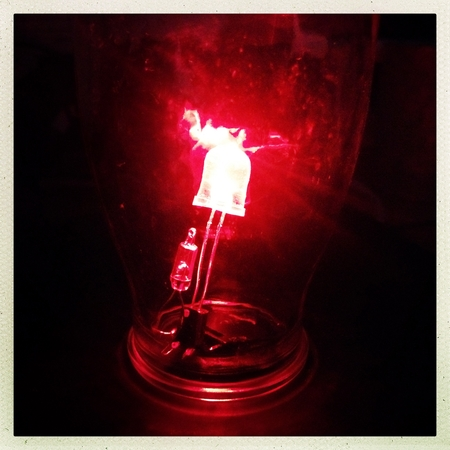

~ END ~