令人煩躁的 I LOVE YOU 滑鼠
====================

The Idea
--------
當按下滑鼠左鍵的時候，會發出 I LOVE YOU 的聲音。

[點圖片看demo]

Hacking
-------
在這個專案中，我嘗試將玩具鑰匙圈的電路板，與滑鼠做結合。你可以找尋任何可以發出聲音的鑰匙圈或是布偶。這是我在露天拍賣花 $49/個 買的鑰匙圈。

[點圖片看影片]

拆開後發現它的電路結構其實不複雜，就是以一顆按鈕，控制要不要讓鈕扣電池的電力，通過電路板上的元件。然後，你需要用電表來確認，哪個接點跟哪條線是相連的。這樣最後組裝時才不會搞錯正負極。

先去 3C 賣場買了一個新的滑鼠。因為考慮到要塞電路進去，所以有刻意挑體積大一點的。

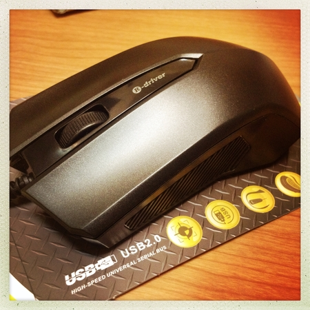

買回來的第一步，當然就是拆開來觀察看看。

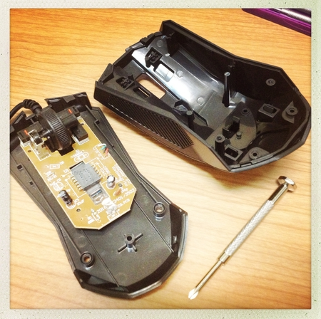

你可以發現滑鼠的左右鍵，其實是壓下畫面中紅色的那個微動開關 (其實連中鍵也是)。

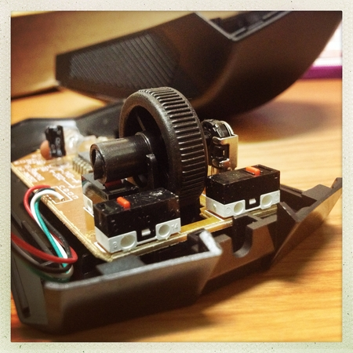

然後觀察他的電路板。因為滑鼠是由 USB 供電的，從電路板上可以看到，USB 會拉出四條不同顏色的線，標示 C、D、G、V，分別代表甚麼意思可以看這篇：[USB to PS/2 mouse or keyboard adapter pinout](http://pinouts.ru/InputCables/usb_ps2_mouse_pinout.shtml)。這個專案中，我只關心黑線的 GND 和紅線的 VCC (5V)

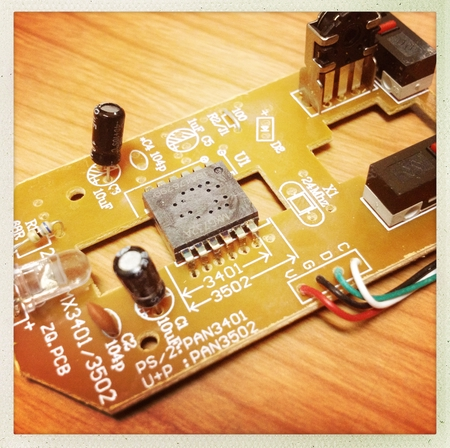

接著簡單 trace 一下線路，這時候電表仍然是你的好朋友，它可以讓你知道哪條線跟哪個接點是相連的。

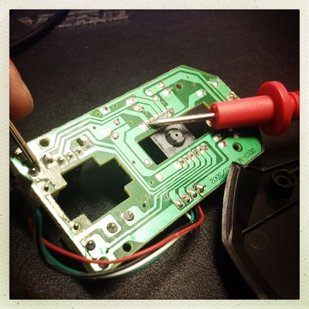

因為我們想要做的事情，是當按下滑鼠左鍵的時候，要讓滑鼠發出聲音，所以我必須要用電表追蹤，當滑鼠按下時，整個電路有什麼變化？

後來我發現，當按下滑鼠左鍵時，會讓滑鼠上面的一顆 IC 的某一根 pin 腳，拉至 0V 的電位。

如下圖，這是我將滑鼠接上筆電的 USB port 供電，然後電表轉到量測電壓的檔位。黑色探針抵住 USB 接出來的 GND 線 (因為要給電表準位，告訴電表這是 0V 的準位)。然後紅色探針抵住 IC 上的某根腳，為什麼會知道要抵住那根腳？是因為我用電表測試過，知道那根腳位連接到滑鼠左鍵的微動開關。

然後你會發現，假如滑鼠左鍵沒按下去的時候，從電表會讀取到 5V 的電壓值，假如按下去，如圖會顯示 0V。(一隻手測試一隻手拍照，手快抽筋 XD)

所以滑鼠按下的動作發生時，整個電路中有什麼變化？就是那個 IC 腳位會拉 LOW，從 5V 降到 0V。

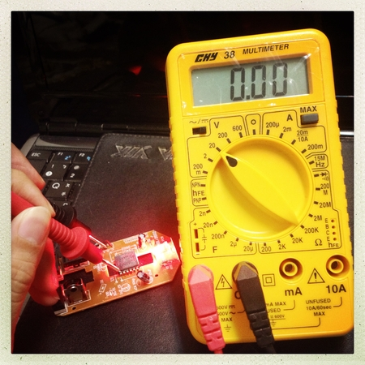

其實若是用放大鏡看滑鼠中間的那顆 IC，你會看到這行字 "MX8732A" 代表這顆 IC 的名字，google 一下應該就可以找到規格書 (datasheet) 了。[USB/PS2 Single Chip Optical Mouse Sensor](http://www.lizhiic.com/admin/Product20/MX8732A%20SPEC-V1-1.pdf)

裡面有個應用示例圖，你可以看到我框紅色的地方，IC 的左上角標 LB 代表是 "Left button  input"，線接出去的地方標示的是開關，就是你滑鼠左鍵的位置，尾端是接地。代表開關按下的時候，那個 LB 腳位將會接地，所以會被拉到 0V 的準位。不過就算不知道這些細節也是可以做專案啦...XD

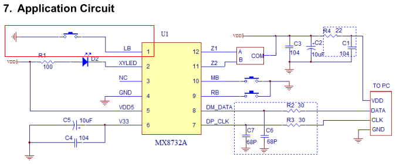

然後我把必要的線，USB 拉出來的 GND (黑)、5V (紅)，以及 IC 的 LB pin (藍) 都用導線先拉出來。

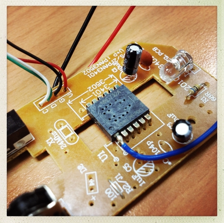

接著是比較麻煩的地方，首先我買的鑰匙圈，是按下鑰匙圈上的按鈕後，它就會發出聲音。它是由 3 個 1.5V 的鈕扣電池驅動的，所以是 3 x 1.5V = 4.5V。也就是按鈕按下的時候，他會供給電路 4.5V 的電，然後發出聲音。所以平常沒按按鈕就不會通電。(= 0V)

所以我們可以說，對鑰匙圈那端的電路而言，要讓電路發出聲音的條件，相當於讓電路由 0V 拉到 4.5V。這點其實是跟滑鼠按鍵相反的，滑鼠是：當按下左鍵的時候，相當於讓 IC 的 LB 腳位，由 5V 降至 0V。

所以你必須有一個機制，讓你按下滑鼠的左鍵時，LB 腳位雖然從 5V 降到 0V，但會讓鑰匙圈的電路，從 0V 拉升到 4.5V 然後發出聲響。

花了一點時間研究，但最後還是直接去問硬體工程師比較快 XD 他告訴我用 p-channel 的 MOSFET 可以做到我要的功能。為了方便插麵包版驗證，我去買了 [IRF5305](http://www.redrok.com/MOSFET_IRF5305_-55V_-31A_6mO_Vth-4.0_TO-220.pdf) (datasheet)

如下圖紅框，概念是當 GS 間的電壓小於一定的準位的時候，DS 的路線就會導通。所以規格書要看 VGS(th)：Gate Threshold Voltage 這個項目。但太細節的東西我也看不懂啦，反正有硬體工程師罩，就偷懶一下 XD 

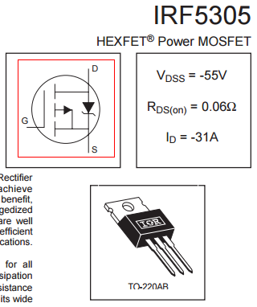

這是最後我接線的樣子。所以當滑鼠左鍵按下時，G 的位子會拉到 0V，造成 V(gs) 的準位小於規格書定義的電壓值，然後 DS 段就會導通，對蜂鳴器 (Buzzer) 那邊的電路供電，發出聲響。

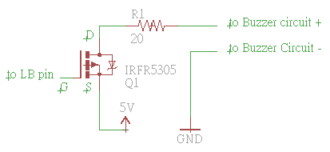

保險起見，先在麵包版上測試。

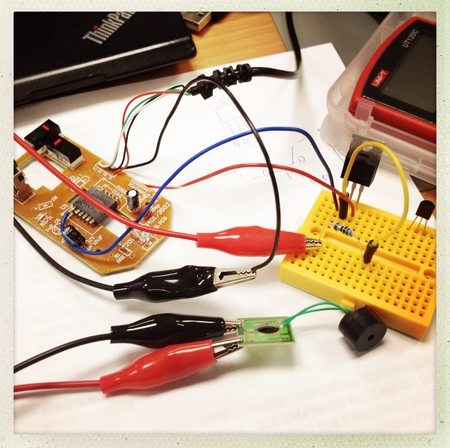

我發現 D 腳位拉出去的線，使用不同的電阻的時候，會發出不同的聲響，大小聲也有差。

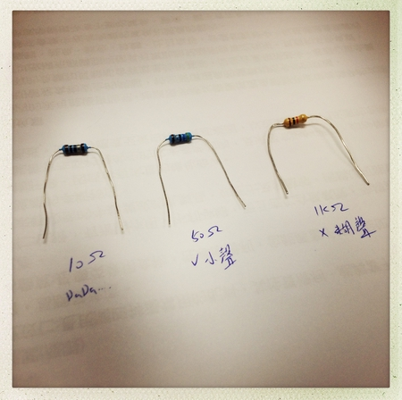

後來乾脆先接一顆可變電阻，測試看看哪一個電阻值的效果最好，最後選用 20 ohm 的電阻。

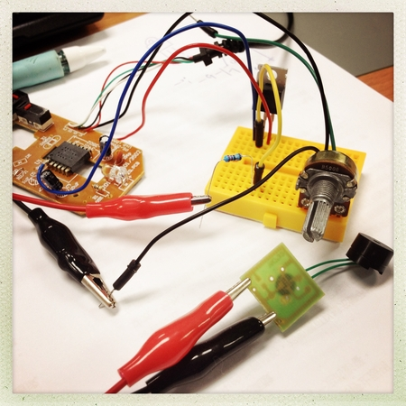

電路驗證沒問題之後，接下來的事情就相對簡單、比較像是做勞作了。因為不可能把麵包版塞進去滑鼠裡面，所以勢必得將電路移到小塊的板子上。

我在電子材料行買了幾塊電木洞洞板，原本還在想說要怎麼把它鋸成小塊，問了公司的硬體工程師，他說實驗室有好用的工具。

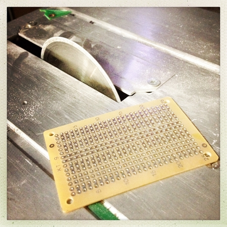

原本以為那是鋸子，但不是。比較像是磨砂輪之類的東西。利用摩擦力裁剪板子，最後我得到了這一小塊的電木板，還把邊緣尖銳的部分給磨了。

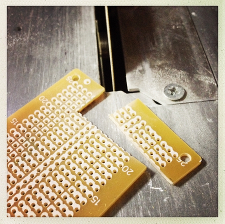

接著就開始將元件焊接上去，當然我有事先安排過位子，所以那塊電木板的大小才會是那樣。

另外，我發現紙膠帶比焊接固定器具好用多了 :)

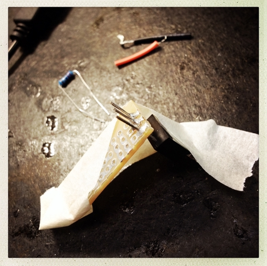

這是最後的樣子。原本不想做開關的，但是為了怕使用的人腦神經衰弱，所以還是加了一個開關，關閉後按滑鼠的左鍵就不會發出聲響囉。

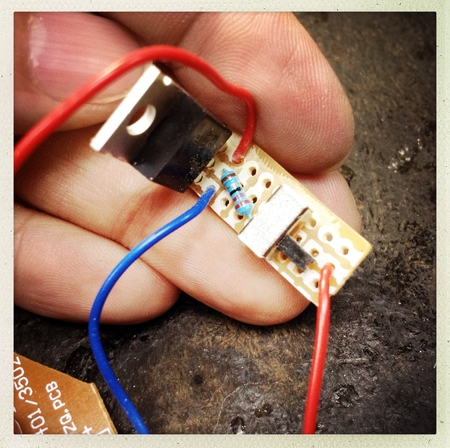

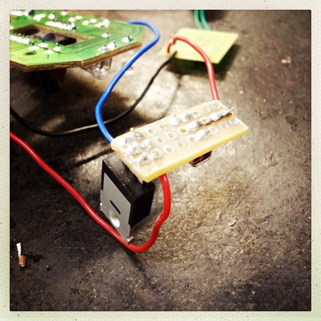

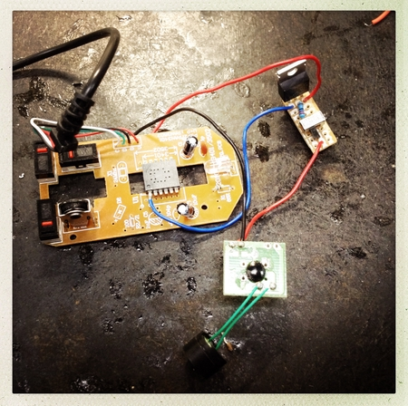

然後仔細安排他們在滑鼠裡面的位子和走線，當然這在焊接之前也要先大概抓一下位子。因為要決定導線要有多長。

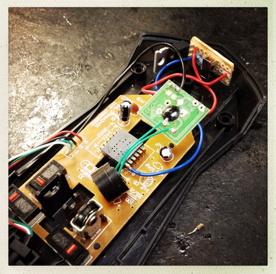

最後，用紙膠帶簡單做一下絕緣，然後儘可能地將它們固定在滑鼠裡面，確定搖晃時不要有聲響。

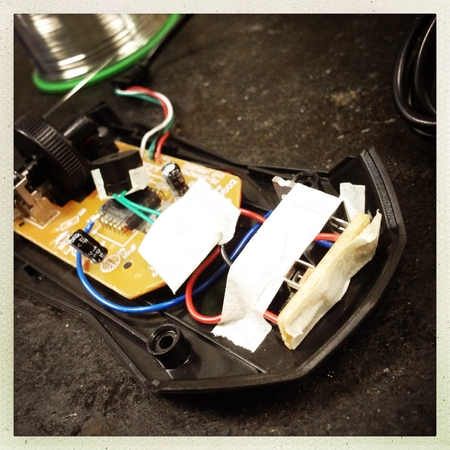

然後將原本的外殼鎖回去，再次測試。確定新的電路不會影響原本滑鼠該有的功能。打完~ 收工!

~ END ~